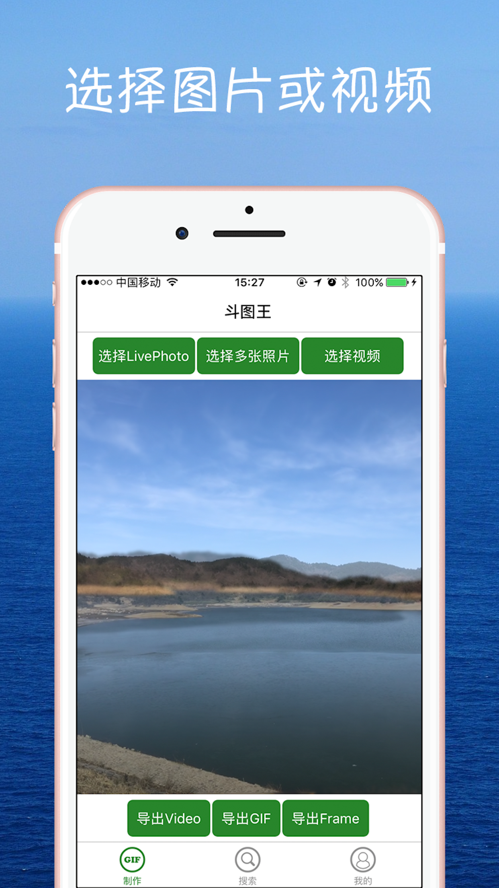
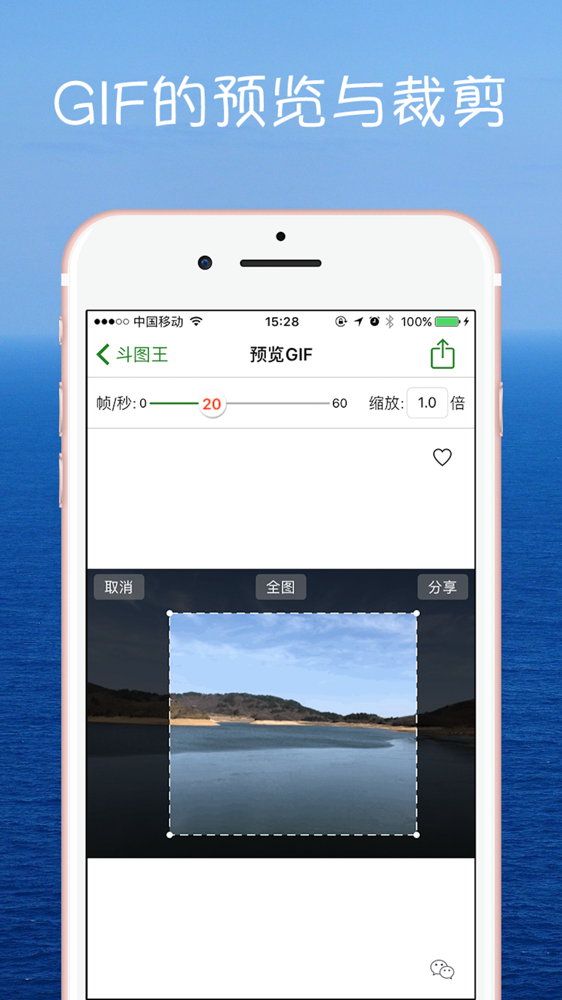
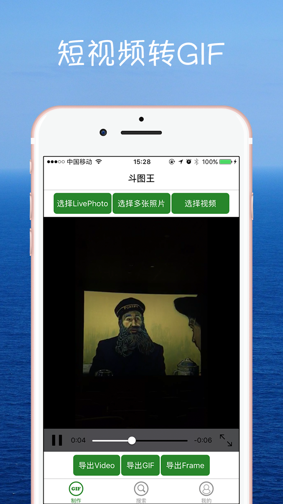

# GIFEmoji - 斗图王 (GIFMaster)

<p align="center">
  
</p>

一个功能强大的 iOS GIF 动画表情制作、编辑、搜索和分享应用
A powerful iOS app for creating, editing, searching, and sharing GIF animations

[]()
[]()
[]()

---

## 📱 应用简介 | Overview

**斗图王 (GIFMaster)** 是一款全功能的 GIF 动画制作工具，支持从多种来源创建 GIF，包括 LivePhoto、视频、静态照片。同时提供 GIF 编辑、搜索、收藏和分享等完整功能。

**GIFMaster** is a comprehensive GIF animation tool that supports creating GIFs from various sources including LivePhotos, videos, and static photos. It also provides complete features for editing, searching, bookmarking, and sharing GIFs.

## ✨ 核心功能 | Key Features

### 🎨 GIF 制作 | GIF Creation
- **LivePhoto 转换**: 将 LivePhoto 转换为 GIF 动画或短视频
- **多图合成**: 选择多张照片生成 GIF 动画
- **视频转 GIF**: 从视频中提取并生成 GIF
- **帧率调整**: 自定义 GIF 播放速度
- **尺寸缩放**: 调整 GIF 输出大小

### ✂️ GIF 编辑 | GIF Editing
- 裁剪指定区域
- 调整帧率和尺寸
- 批量导出图片帧
- 单帧保存和分享

### 🔍 GIF 搜索 | GIF Search
- 海量 GIF 图片搜索
- 支持复制 GIF 网址
- 在线 GIF 预览
- 直接分享搜索结果

### 💾 收藏管理 | Collection Management
- 自定义分类管理
- 收藏夹功能
- 本地数据库存储
- 分类编辑和删除

### 📤 分享功能 | Sharing
- 微信/QQ 分享
- 系统分享扩展
- 其他应用导入

## 📸 应用截图 | Screenshots

<p align="center">
  
  
  
</p>

## 🏗️ 技术架构 | Architecture

### 项目结构 | Project Structure

```
GIFEmoji/
├── GIFEmoji/                    # 主应用
│   ├── Make/                    # GIF 制作模块
│   │   ├── GenGIFViewController # 主创建界面
│   │   ├── Detail/              # 预览控制器
│   │   └── View/                # 自定义视图
│   ├── Search/                  # GIF 搜索模块
│   │   ├── SearchGIFViewController
│   │   └── LWImageModel         # 图片数据模型
│   ├── MyGIF/                   # 收藏管理模块
│   │   ├── LWMyGIFViewController
│   │   └── LWCategoriesPopoverViewController
│   ├── Common/                  # 公共组件
│   │   ├── LWSymbolService      # 数据库服务
│   │   └── WebView/             # Web 浏览器
│   ├── Helper/                  # 工具类和扩展
│   │   ├── NSGIF                # GIF 生成核心
│   │   └── Categories           # UIKit 扩展
│   ├── Libs/                    # 第三方库
│   └── Resources/               # 资源文件
│       └── data/                # 默认数据库
└── GIFShareExtension/           # 分享扩展
    └── ShareNavigationViewController
```

### 核心技术栈 | Tech Stack

#### 开发语言
- **Objective-C** - 主要开发语言
- **Xcode** - 开发工具

#### 依赖管理
- **CocoaPods** - 第三方库管理

#### 主要框架
- `AVFoundation` - 视频处理
- `Photos` / `PhotosUI` - LivePhoto 和相册访问
- `ImageIO` - GIF 编解码
- `CoreGraphics` - 图像处理
- `SQLite` - 本地数据库

#### 第三方库

**UI 框架**
- `FLAnimatedImage` - 高性能 GIF 渲染
- `SDWebImage` - 图片加载和缓存
- `YMSPhotoPicker` - 自定义相册选择器
- `SVProgressHUD` - 加载指示器
- `Masonry` - 自动布局

**功能库**
- `NSGIF` - 视频转 GIF 核心算法
- `OpenShare` - 微信/QQ 分享
- `FCFileManager` - 文件管理
- `YYModel` - 数据模型

**集成服务**
- `Google-Mobile-Ads-SDK` - 广告
- `UMCAnalytics` - 友盟统计
- `UMCPush` - 推送通知
- `LWPurchase` - 内购管理 (自定义库)
- `LWHUD` - HUD 组件 (自定义库)

**调试工具**
- `FLEX` - 运行时调试工具

## 🚀 开发指南 | Development Guide

### 环境要求 | Requirements

- **Xcode**: 11.0+
- **iOS Deployment Target**: iOS 9.0+
- **CocoaPods**: 1.9.0+
- **macOS**: 10.14+

### 安装步骤 | Installation

1. **克隆仓库**
```bash
git clone https://github.com/yourusername/GIFEmoji.git
cd GIFEmoji
```

2. **安装依赖**
```bash
pod install
```

3. **打开工作空间**
```bash
open GIFEmoji.xcworkspace
```

⚠️ **注意**: 必须打开 `.xcworkspace` 文件，而不是 `.xcodeproj`

### 项目配置 | Configuration

#### 1. 第三方服务配置

**友盟 (UMeng)**
- App Key: 在 `AppDelegate.m` 中配置
- 注册地址: https://www.umeng.com/

**Google AdMob**
- 广告单元 ID 需要在代码中配置
- 注册地址: https://admob.google.com/

**微信开放平台**
- App ID: `wxb4b64828a439e04b` (需替换为你的)
- 注册地址: https://open.weixin.qq.com/

**QQ 开放平台**
- App ID: `1106605943` (需替换为你的)
- 注册地址: https://open.tencent.com/

#### 2. Bundle Identifier
修改为你自己的 Bundle ID: `com.yourcompany.GIFEmoji`

#### 3. URL Schemes
在 `Info.plist` 中配置以下 URL Schemes:
- `GIFEmoji` - 应用自定义 Scheme
- `wxb4b64828a439e04b` - 微信回调
- `tencent1106605943` - QQ 回调

### 编译运行 | Build & Run

```bash
# 使用 Xcode 编译
1. 选择目标设备或模拟器
2. 按 Cmd + R 运行

# 或使用命令行
xcodebuild -workspace GIFEmoji.xcworkspace \
           -scheme GIFEmoji \
           -configuration Debug \
           -destination 'platform=iOS Simulator,name=iPhone 14'
```

## 📊 数据存储 | Data Storage

### SQLite 数据库
- **位置**: `Resources/data/GIFEmojiData`
- **服务类**: `LWSymbolService`
- **表结构**:
  - `Category` - 收藏分类表
  - `Symbol` - GIF 符号/图片表

### 本地文件
- **GIF 文件**: 存储在应用沙盒的 `animoji` 目录
- **管理工具**: `FCFileManager`

## 🔧 核心模块说明 | Core Modules

### 1. GIF 生成模块 (Make)

**主要类**: `GenGIFViewController`

**支持的输入模式** (`SelectedMode` 枚举):
```objc
typedef NS_OPTIONS(NSUInteger, SelectedMode) {
    LivePhotoMode = 0,      // LivePhoto 模式
    StaticPhotosMode = 1,   // 多图模式
    VideoMode = 2,          // 视频模式
    GIFMode = 3,           // GIF 编辑模式
};
```

**核心流程**:
1. 选择输入源 (LivePhoto/照片/视频)
2. 预览和调整参数
3. 生成 GIF 或导出其他格式
4. 保存到相册或分享

### 2. GIF 搜索模块 (Search)

**主要类**: `SearchGIFViewController`

**功能**:
- 网络图片搜索
- 瀑布流展示
- 下拉刷新/上拉加载
- 收藏和分享
- 内容举报

**广告集成**: 使用 `GADInterstitial` 展示插页广告

### 3. 收藏管理模块 (MyGIF)

**主要类**: `LWMyGIFViewController`

**功能**:
- 分类管理
- 图片收藏
- 编辑和删除
- 频率统计

**数据同步通知**:
- `Notification_CategoryChanged` - 分类变更
- `Notification_FavoriteChanged` - 收藏变更

## 📦 分享扩展 | Share Extension

**Target**: `GIFShareExtension`

允许从其他应用直接导入图片/视频到 GIFEmoji 进行处理。

**入口**: `ShareNavigationViewController`

## 🔐 隐私权限 | Privacy Permissions

需要在 `Info.plist` 中声明:
- `NSPhotoLibraryUsageDescription` - 访问相册
- `NSPhotoLibraryAddUsageDescription` - 保存到相册
- `NSCameraUsageDescription` - 相机访问

## 🐛 调试技巧 | Debugging

### 使用 FLEX
```objc
#ifdef DEBUG
[[FLEXManager sharedManager] showExplorer];
#endif
```

### 日志输出
```objc
#ifdef DEBUG
#define Log(format, ...) NSLog(format, ## __VA_ARGS__)
#else
#define Log(format, ...)
#endif
```

## 📝 开发规范 | Code Guidelines

### 命名约定
- **前缀**: `LW` 用于自定义类
- **类别**: 使用 `+` 分类命名 (如 `UIColor+HexValue`)
- **宏定义**: 全大写下划线分隔

### 内存管理
```objc
#define weakify(var) __weak typeof(var) weak_##var = var;
#define strongify(var) __strong typeof(var) var = weak_##var;
```

### 版本兼容
```objc
#define SYSTEM_VERSION_GREATER_THAN_OR_EQUAL_TO(v) \
    ([[[UIDevice currentDevice] systemVersion] compare:v \
      options:NSNumericSearch] != NSOrderedAscending)
```

## 🌐 支持网站 | Support

- **官方网站**: http://app.wodedata.com/myapp/gifemoji.html
- **开发者主页**: https://itunes.apple.com/cn/developer/wei-luo/id990121194

## 📄 许可证 | License

本项目采用 MIT 许可证 - 详见 [LICENSE](LICENSE) 文件

## 👨‍💻 作者 | Author

**Luo Wei** (罗威)
- Copyright © 2018 Luo Wei. All rights reserved.

## 🙏 致谢 | Acknowledgments

感谢以下开源项目的贡献:
- [FLAnimatedImage](https://github.com/Flipboard/FLAnimatedImage)
- [SDWebImage](https://github.com/SDWebImage/SDWebImage)
- [NSGIF](https://github.com/NSRare/NSGIF)
- [FLEX](https://github.com/FLEXTool/FLEX)
- 以及所有使用的开源库

## 📮 联系方式 | Contact

如有问题或建议，欢迎通过以下方式联系:
- 提交 Issue
- Pull Request
- 邮件联系开发者

---

**注意**: 本项目仅供学习和参考使用。如需商业使用，请替换所有第三方服务的 API Key 和 App ID。
